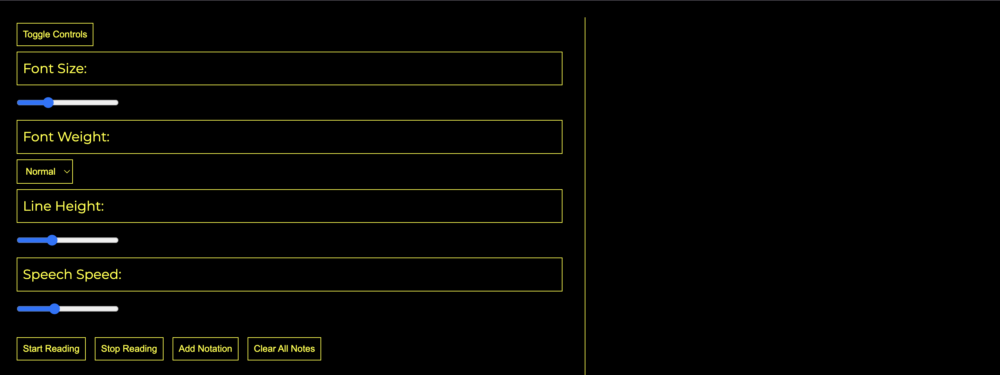

# Human Centered Design

## Inhoudsopgave

- [Week 1](#week-1)
  - [Introductie](#introductie)
  - [Kennismaking](#kennismaking)
  - [Eerste prototype](#eerste-prototype)
  - [Feedback met docent](#feedback-met-docent)
- [Week 2](#week-2)
  - [Eerste versie testen](#eerste-versie-testen)
  - [Feedback verwerken](#feedback-verwerken)
  - [Feedback met docent](#feedback-met-docent-1)
- [Week 3](#week-3)
  - [Tweede versie testen](#tweede-versie-testen)
  - [Feedback verwerken](#feedback-verwerken-1)
  - [Feedback met docent](#feedback-met-docent-2)
- [Week 4](#week-4)
  - [Derde versie testen](#derde-versie-testen)
  - [Wat zou ik doen als ik meer tijd had?](#wat-zou-ik-doen-als-ik-meer-tijd-had)
- [Exclusive Design Principles](#exclusive-design-principles)
- [Slotwoord](#slotwoord)

## Week 1

### Introductie

HCD is elke woensdag en donderdag. Op de eerste woensdag kregen we te horen wat de opdracht was en wie de personen waren waarvoor wij specifiek iets moesten ontwerpen. Ik zat in de groep van Roger Ravelli. Hij is slechtziend, en zijn zicht wordt steeds slechter. Hij is momenteel student aan filosofie en wilt graag boeken kunnen lezen/luisteren en daarbij aantekeningen kunnen maken. Aangezien onze eerste "test" al dezelfde middag was, hadden we met de hele groep vragen bedacht voor roger om beter zijn situatie te begrijpen.

### Kennismaking

Om 13:00 was het tijd om kennis te maken met roger. Hierbij hebben we veel geleerd over roger en zijn situatie. Hij heeft een unieke oogaandoening die niet te verbeteren is en zelfs slechter wordt. Hij verliest het zicht vanuit het midden dus ziet alleen nog aan de randjes een klein beetje, maar ook dit wordt steeds minder. Het liefst doet roger nog zoveel mogelijk met zijn zicht, maar hij gebruikt wel tools omdat het niet meer mogelijk is voor hem om alleen alles met zicht te doen. Helaas kan hij zelfs met zijn screenreader soms niet websites goed gebruiken, omdat deze niet toegankelijk waren. Ook heeft hij liever donkere kleuren. Geel op zwart werkt goed voor hem. Om te kijken is voor roger ook vermoeiend, omdat zijn ogen verschillende dingen zien. Zijn linker oog is nammelijk nog een stuk beter dan zijn rechter oog. Dit is een samenvatting van een hele lijst notities over roger zijn precieze situatie.

### Eerste prototype

Toen ben ik aan de slag gegaan met het maken van een eerste versie. Hieronder zijn een aantal foto's van het prototype die ik heb gemaakt:

_Prototype v1 - Text_

_Prototype v1 - Settings_

_Prototype v1 - Make Notation_

_Prototype v1 - Notation_

### Feedback met docent

Aan het einde van de week hadden we feedback gesprekjes en hierin vertelde we wat we hadden gedaan in die week en hoe alles ging.

## Week 2

### Eerste versie testen

De feedback die ik hiervoor had gekregen is dat hij graag een instelling wou om de tekst container groter of kleiner te maken. Ook wou hij graag meer kleur dan alleen geel om onderscheid te kunnen maken tussen buttons, tekst en headings (Oranje bijvoorbeeld). Hij vond het erg fijn dat je een notatie gesproken kon maken, maar wou ook graag de optie om te kunnen typen.

Daarnaast kwam ik er zelf achter dat op het moment als je focus hebt op een element dat de speech eerst dat woord afmaakt, voordat hij begint aan het nieuwe woord wat er soms voor zorgde dat roger dacht dat hij op een andere button stond. Ook moest ik de tab structuur iets duidelijker maken en kwam ik achter een bug waardoor worden die al eerder gelezen waren gehighlight worden. Dus als er "of" in de tekst is genoemd worden latere versies niet gehighlight, maar verspringt hij naar de eerste instantie van dat woord.

### Feedback verwerken

Ik heb na de test de feedback verwerkt en een nieuwe versie gemaakt. Helaas ben ik vergeten foto's te nemen van deze versie, maar hij lijkt meer op versie 3, met minder features (Daarvan heb ik wel foto's).

### Feedback met docent

Aan het einde van de week hadden we weer een feedback gesprek en hierin konden we laten zien wat we hadden gemaakt en hadden we besproken hoe het testen ging.

## Week 3

### Tweede versie testen

Tijdens de tweede test was roger al best tevreden, maar er waren nog een aantal aanpassingen om de website beter te maken voor hem. Hij wou graag een duidelijker contrast tussen notities die hij had gemaakt en buttons, deze vond hij door de kleur te veel op elkaar lijken. Ook wou hij graag de tekst die hij typte bij het maken van een notitie groter hebben. En hij wou de settings ook terug hebben. Deze waren niet in v2, omdat ik de settings aan het vernieuwen was, maar deze niet op tijd af kon krijgen. Ten slotte vond hij het erg fijn dat je de notitie nu in kon spreken en kon typen, maar hij wou graag een button met een microfoontje, zodat het duidelijk was voor hem wanneer hij kan spreken. Eerst ging namelijk de microfoon meteen aan bij het klikken van "make note".

### Feedback verwerken

Met deze feedback ben ik aan de slag gegaan om de laatste versie te maken. De nieuwste versie is eigenlijk een verbeterde versie van v2, met meer features en de settings terug. Hier zijn een aantal foto's van het laatste prototype:

_Prototype v3 - Layout_

_Prototype v3 - Settings_

_Prototype v3 - Make Notation_

_Prototype v3 - Notation_

_Prototype v3 - Text Highlight_

### Feedback met docent

Dit was het laatste feedback gesprekje en hierin konden we nog onze laatste vragen stellen en ons nieuwste prototype laten zien.

## Week 4

### Derde versie testen

Tijdens de laatste test kwam ik er achter dat niet alle settings werden uitgesproken, dit zou namelijk wel moeten. Daarnaast was het enige andere puntje dat het hamburger menu te klein was. Voor de rest was Roger erg enthousiast hierover en vond hij mijn concept ook erg goed.

_Website - Concept_

Hij vond de opties erg leuk en zou deze graag uitgewerkt zien.

### Wat zou ik doen als ik meer tijd had?

Als ik meer tijd had zou ik ten eerste alle bugs oplossen in v3 van mijn prototype. Daarnaast zou ik aan de slag gaan met het uitwerken van mijn initiele concept om zo de website completer te maken voor Roger. Dit betreft dus alle functionaliteiten die te zien zijn bij [Website - Concept](images/concept.png).

## Exclusive Design Principles

### Study situation

Zoals eerder al te lezen was hebben we een heel lang gesprek gehad met Roger waarin we allemaal details hebben gekregen over zijn huidige situatie.

### Ignore conventions

De meeste websites zijn ontworpen voor mensen met goed zicht, met subtiele visuele aanwijzingen die voor Roger niet werken. In plaats daarvan heb ik:

- Gekozen voor hoge contrasten met geel en oranje op zwart, in tegenstelling tot de typische zwarte tekst op witte achtergrond
- De interface vereenvoudigd met minder elementen per scherm
- Grotere knoppen gemaakt die duidelijk van elkaar te onderscheiden zijn
- Gebruik gemaakt van spraakinteractie naast traditionele invoermethoden

### Prioritise identity

Bij het ontwerpen heb ik Roger's identiteit centraal gesteld door:

- Specifiek te kiezen voor de kleurencombinatie geel/oranje op zwart die hij zelf aangaf als prettig
- De interface aan te passen aan zijn specifieke manier van navigeren (combinatie van beperkt zicht en screenreader)
- Instellingen toe te voegen die hij kan aanpassen naar zijn persoonlijke voorkeuren
- Verschillende invoermethoden aan te bieden (spraak en typen) zodat hij zelf kan kiezen wat in welke situatie het beste werkt

### Add nonsense

Ik heb overdreven kleur contrasten toegevoegd die het voor roger prettiger maken om de website te gebruiken. Voor de rest heb ik uiteidelijk niet veel nonsense toegevoegd, omdat roger aangaf dat hij het juist wel fijn vond hoe overzichtelijk het was.

## Slotwoord

Ik vond het erg interessant om specifiek voor één persoon te ontwerpen. Hierdoor heb ik eigenlijk nauwelijks iets toegapast van de bestaande design standaarden, omdat ik nu alleen voor Roger aan de slag ben gegaan. Ik vond het ook leuk om echt met de doelgroep, Roger dus, te testen. Al met al vond ik dit een erg interessant en uniek vak!
